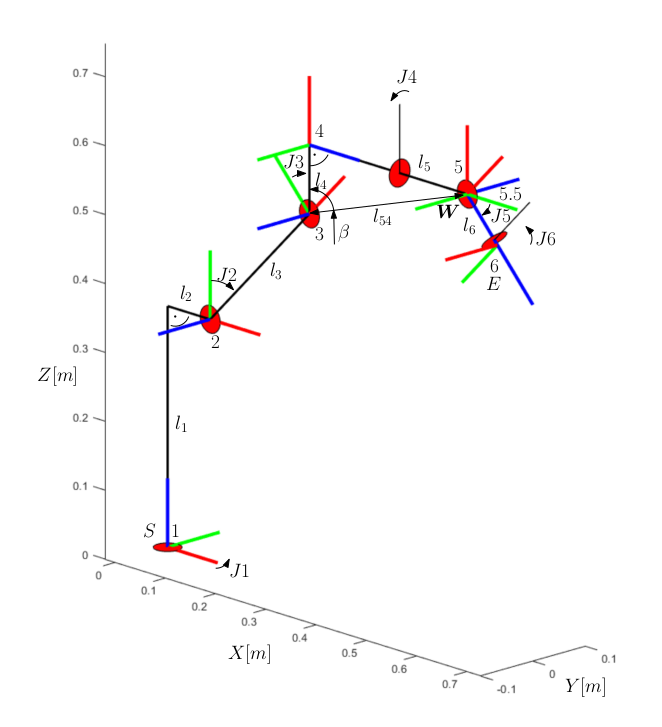

# 6DoF Inverse Kinematics

## Requirements

 - [Eigen](https://eigen.tuxfamily.org/index.php?title=Main_Page)
 - [GTest](https://google.github.io/googletest/)
 - [CMake](https://cmake.org/)

## Usage


To compile examples and test:

```
mkdir build
cd build
cmake ..
make
ctest
```

Simple example

```cpp

#include "ikt6.h"

int main() {

  Vector6d lengths, offsets, limits_max, directions, limits_min;

  lengths <<     650,     325,    1150,  300,  1590,    225;     // Lenghts
  offsets <<       0,       0,  M_PI/2,    0,     0, M_PI/2;     // Joint offsets in Rad
  directions <<    1,       1,      -1,   -1,    -1,     -1;     // Joint directions
  limits_max <<  180,      76,      90,  360,   130,    360;     // Joint limits max in Rad
  limits_min << -180,     -60,     -86, -360,  -130,   -360;     // Joint limits min in Rad
  limits_max = limits_max * M_PI/180;
  limits_min = limits_min * M_PI/180;
  Isometry3d base = Isometry3d::Identity();
  Isometry3d tool = Isometry3d::Identity();

  Robot robot = ikt6_robot_init( "Motoman", lengths, offsets, directions, limits_max, limits_min, base, tool);


  // direct kinematic
  Vector6d J;
  J << 0, 0, 0, 0, 0, 0;
  Vector6d P = ikt6_dkt(&robot, J); // -> (x,y,z, roll, pitch, yaw)

  // Inverse kinematics
  J = ikt6_ikt(&robot, P); // ()

}


```




## References

 - [Mitsubishi Melfa Robot Control Toolbox for Matlab](https://cw.fel.cvut.cz/wiki/help/common/robot_mitsubishimelfa_toolbox#download)
 - [kinematics_6dof_ros_pkg](https://gitlab.ciirc.cvut.cz/uhrovter/kinematics_6dof_ros_pkg) python implementation of the same.

